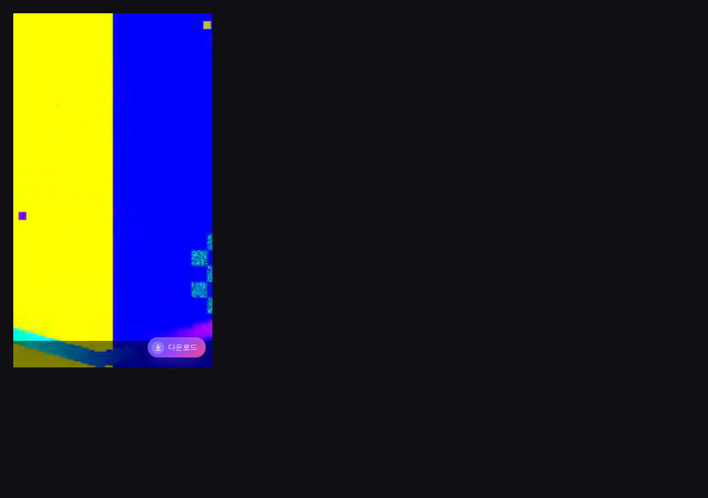
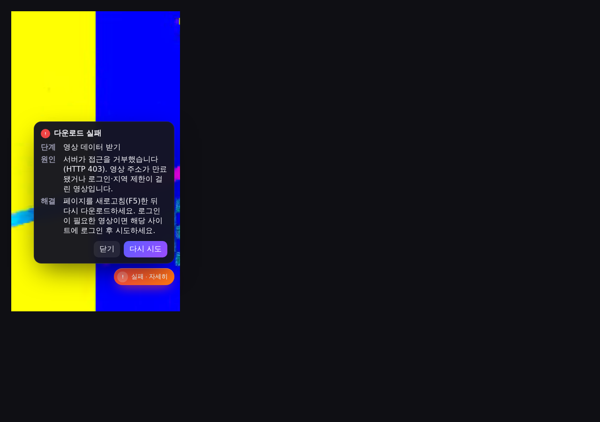
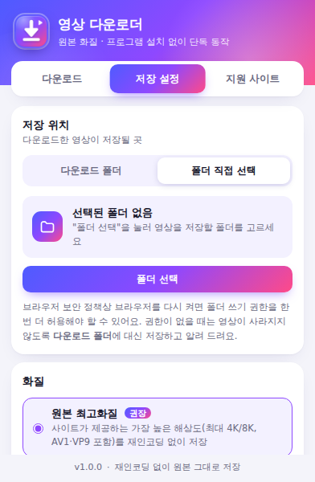

# 웨일 영상 다운로더

웨일 브라우저 확장프로그램 하나로 영상 아래 **다운로드** 버튼을 눌러 원본 화질로 바로 저장합니다.
로컬 헬퍼나 별도 프로그램은 필요 없습니다. 영상·음성 병합(MP4)도 확장프로그램 안에서 처리합니다.


| 영상 하단 버튼 | 실패 시 단계·원인·해결 | 팝업 · 저장 위치 |
|---|---|---|
|  |  |  |

## 지원 사이트

| 사이트 | 받는 원본 | 방식 |
|---|---|---|
| 유튜브 · 쇼츠 | 최고 해상도 영상 스트림 + AAC 음성 (최대 4K/8K) | 영상·음성 병합 → MP4 |
| 틱톡 | `bitrateInfo` 중 최고 해상도 (워터마크 없는 재생 주소) | 원본 파일 |
| 인스타그램 (릴스·게시물) | DASH 최고 해상도 + 음성, 없으면 `video_versions` 최고 | 병합 또는 원본 파일 |
| 페이스북 릴스·동영상 | DASH 최고 해상도 + 음성, 없으면 HD 파일 | 병합 또는 원본 파일 |
| X (트위터) | 최고 비트레이트 MP4 | 원본 파일 |
| 블루스카이 | 업로더가 올린 **업로드 원본 파일**(PDS blob), 없으면 HLS 최고화질 | 원본 파일 / HLS → MP4 |
| 샤오홍슈 | `originVideoKey` 업로드 원본, 없으면 스트림 최고 해상도 | 원본 파일 |
| 스냅챗 (스포트라이트·스토리) | 미디어 원본 주소 | 원본 파일 |
| 도우인 | `bit_rate` 최고 해상도 (워터마크 없는 주소) | 원본 파일 |
| 콰이쇼우 | manifest 최고 해상도 | 원본 파일 |
| 빌리빌리 | DASH 최고 해상도 + 최고 음질 (로그인 시 1080p 이상) | 영상·음성 병합 → MP4 |
| 웨이보 | `playback_list` 최고 해상도 | 원본 파일 |
| 핀터레스트 | MP4 와 HLS 중 더 높은 해상도 | 원본 파일 / HLS → MP4 |
| 네이버 TV · 네이버 클립 (블로그·카페 영상 포함) | 재생 정보 API 의 최고 해상도 | 원본 파일 / DASH 병합 |
| 비메오 (임베드 포함) | 1080p 이상 프로그레시브 또는 HLS 최고화질 | 원본 파일 / HLS → MP4 |
| 데일리모션 | HLS 최고화질 | HLS → MP4 |
| 그 밖의 사이트 | 페이지가 실제로 받은 영상 파일·HLS·DASH 감지 | 자동 판단 |

재인코딩은 하지 않습니다. 서버가 준 압축 데이터를 그대로 MP4 에 옮겨 담기 때문에 화질 손실이 없습니다.

## 설치 (웨일)

1. 이 저장소에서 `extension` 폴더를 받습니다. (또는 `node tools/pack.mjs` 로 만든 `dist/whale-video-downloader-v1.0.0.zip` 압축 해제)
2. 웨일 주소창에 `whale://extensions` 입력
3. 오른쪽 위 **개발자 모드** 켜기
4. **압축해제된 확장 프로그램을 로드합니다** → `extension` 폴더(압축 해제했다면 `whale-video-downloader` 폴더) 선택
5. 툴바의 확장프로그램 아이콘을 고정해 두면 편합니다.

설치 전에 열어 둔 탭에도 자동으로 버튼이 붙습니다. 혹시 안 보이면 그 탭을 새로고침(F5)하세요.

## 사용법

- **영상 하단 버튼**: 사이트에 들어가면 영상 아래쪽에 `다운로드` 버튼이 떠 있습니다. 누르면 바로 저장됩니다.
  - 진행 중에는 진행률 링과 `1080p · 42%` 처럼 화질·진행률이 표시됩니다.
  - 끝나면 `저장 완료` 와 파일 이름·저장 위치·화질이 보이고, `폴더 열기` 로 바로 열 수 있습니다.
- **확장프로그램 아이콘(팝업)**
  - `다운로드` 탭: 지금 탭에서 찾은 영상 목록(버튼이 가려진 경우에도 여기서 받기), 최근 다운로드 기록·진행률·오류 상세
  - `저장 설정` 탭: 저장 위치, 화질, 파일 이름 형식, 버튼 위치
  - `지원 사이트` 탭: 사이트별로 버튼 켜기/끄기

### 저장 위치 설정

| 방식 | 설명 |
|---|---|
| 다운로드 폴더 (기본) | 브라우저 다운로드 폴더 안의 하위 폴더(기본 `영상 다운로드`)에 저장. 하위 폴더 이름은 팝업에서 바꿀 수 있고, 비우면 다운로드 폴더에 바로 저장 |
| 다운로드마다 위치 묻기 | 저장할 때마다 폴더·파일 이름을 고르는 창 |
| 폴더 직접 선택 | PC 의 아무 폴더나 지정해 그 폴더에 바로 저장 (웨일의 File System Access 기능) |

폴더 직접 선택 시 알아 둘 점
- 브라우저 보안 정책상 `다운로드`·`바탕화면` 폴더 **자체**는 고를 수 없습니다. 그 안에 새 폴더를 만들어 선택하세요.
- 브라우저를 다시 켜면 보안상 권한을 한 번 더 허용해야 할 수 있습니다. 권한이 없는 동안에는 영상이 사라지지 않게 **다운로드 폴더에 대신 저장**하고 그 사실을 알려 줍니다. 팝업 → 저장 설정 → `권한 다시 허용` 한 번이면 됩니다.
- 같은 이름이 있으면 덮어쓰지 않고 `(1)`, `(2)` 를 붙입니다.

### 화질

- **원본 최고화질 (기본)**: 가장 높은 해상도. 유튜브 1440p 이상은 VP9/AV1 이며 그대로 MP4 에 담습니다.
- **호환성 우선 (H.264)**: 편집 프로그램·구형 기기에서 바로 열리는 H.264 우선 (유튜브는 보통 최대 1080p).

## 오류 메시지

모든 실패는 **단계 · 원인 · 해결** 세 줄로 알려 줍니다. 버튼의 `실패 · 자세히` 를 누르거나 팝업의 최근 기록에서 볼 수 있습니다.

| 단계 | 예시 원인 | 해결 |
|---|---|---|
| 영상 정보 찾기 | 이 게시물의 영상 ID 를 찾지 못함 | 게시물을 클릭해 상세 화면을 연 뒤 다시 시도 |
| 원본 주소 확인 | 유튜브 로그인 필요 영상(연령 제한 등) | 공개 영상인지 확인 |
| 화질 선택 | 응답에 재생 주소 없음(이미지 게시물 등) | 영상 게시물인지 확인 |
| 영상 데이터 받기 | HTTP 403 (주소 만료·로그인·지역 제한) | 새로고침 후 다시, 필요 시 로그인 |
| 영상 형식 분석 | 진행 중인 라이브(HLS) | 다시보기가 올라온 뒤 시도 |
| 파일 쓰기 / 파일 저장 | 폴더 권한 없음, 디스크 공간 부족, 경로가 너무 김 | 권한 재허용, 공간 확보, 파일 이름 형식 변경 |

주소가 만료된 경우 같은 영상의 다른 미러 주소·차선 화질로 자동 재시도한 뒤에도 안 될 때만 실패로 표시합니다.

## 동작 구조

```
extension/
  content/hook.js       페이지 안(MAIN world)에서 사이트가 받는 API 응답 중 영상 주소가 있는 것만 넘겨줌
  content/sites.js      사이트별 어댑터: 화면의 <video> 가 어떤 게시물인지 찾고 원본 데이터 수집
  content/core.js       영상 하단 다운로드 버튼·진행률·오류 패널 (Shadow DOM)
  background/           서비스워커: 화질 선택(builders.js), 원본 주소 확인(resolvers.js: 유튜브·블루스카이·X·네이버·비메오·데일리모션),
                        Referer/User-Agent 헤더 처리(declarativeNetRequest), 브라우저 다운로드, 진행 상황 관리
  offscreen/engine.js   저장 엔진: 원본 파일 병렬 범위 다운로드, 영상+음성 패킷 복사 병합, HLS·DASH → MP4 (mediabunny)
  popup/, picker/       팝업 창, 저장 폴더 선택 창
  vendor/               mediabunny 1.61.0 (MPL-2.0, 순수 JS 미디어 먹서)
```

- 데이터는 어디에도 보내지 않습니다. 영상 사이트·CDN 과 사용자의 PC 사이에서만 오갑니다.
- 쿠키는 페이지와 같은 사이트 주소에만 붙입니다.

## 할 수 없는 것

- DRM(Widevine) 보호 영상 (넷플릭스·디즈니+ 등 유료 OTT)
- 진행 중인 라이브 방송 (끝난 다시보기는 가능)
- 유튜브 연령 제한·회원 전용 영상 (로그인 없이 재생 정보를 받는 방식이라서)
- 비공개·삭제된 게시물, 로그인해야 보이는 게시물(해당 사이트에 로그인해 두면 대부분 가능)
- 사이트가 데이터 구조를 바꾸면 해당 사이트 어댑터를 수정해야 할 수 있습니다.

본인이 올린 영상이나 저작권자가 허락한 영상, 개인 소장 범위에서만 사용하고 각 사이트 이용약관을 지켜 주세요.

## 검증 상태

| 항목 | 상태 | 근거 |
|---|---|---|
| 순수 로직 단위 테스트 (화질 선택·MPD 파서·파일 이름) | CONFIRMED 12/12 | `npm test` |
| 저장 엔진 (병합·HLS·Range·403) | CONFIRMED 7/7 | `npm run test:engine` (Chromium) |
| 17개 사이트 E2E — **모의 사이트** | CONFIRMED 35/35 (배포 ZIP 기준) | `npm run test:e2e` — 실제 Chromium 에 확장 로드, 버튼 클릭, 실제 파일 저장, ffprobe 로 해상도·코덱·음성 확인 |
| 17개 사이트 — **실제 사이트** | UNVERIFIED | 개발 환경의 네트워크 정책이 대상 사이트 접속을 모두 차단(HTTP 403)해 실사이트 다운로드는 아직 확인하지 못함 |
| 웨일 브라우저 실제 설치 | UNVERIFIED | 개발 환경에는 Chromium 만 있음 |
| 폴더 직접 선택 대화상자 | UNVERIFIED (쓰기 경로만 CONFIRMED) | 대화상자는 자동화 불가 → 같은 타입의 폴더 핸들로 직접 저장 경로를 검증 |

모의 사이트는 각 서비스의 실제 페이지 내장 데이터·API 응답 구조를 따라 만들었고, CDN 은 실제처럼 Referer·User-Agent 가 맞지 않으면 403 을 돌려줍니다.
실제 사이트의 구조가 이와 다르면 해당 어댑터를 고쳐야 합니다 — 실사이트 확인이 다음 단계입니다.

## 개발

```bash
npm install              # playwright (테스트용)
npm test                 # 단위 테스트
npm run test:engine      # 저장 엔진 (Chromium, ffmpeg/ffprobe 필요)
sudo npm run test:e2e    # 17개 사이트 E2E (443 포트 사용, ffmpeg/openssl 필요)
npm run icons            # assets/*.svg → extension/icons/*.png
npm run pack             # dist/ 에 설치용 ZIP 생성
```

테스트용 인증서와 영상 픽스처는 처음 실행할 때 자동으로 만들어집니다(`tests/e2e/make-certs.sh`, `tests/fixtures/make-media.sh`).

## 라이선스

- 확장프로그램 코드: 저장소 소유자 결정 전까지 비공개
- `extension/vendor/mediabunny.min.mjs`: [mediabunny](https://github.com/Vanilagy/mediabunny) 1.61.0, MPL-2.0 (`extension/vendor/mediabunny.LICENSE`)
